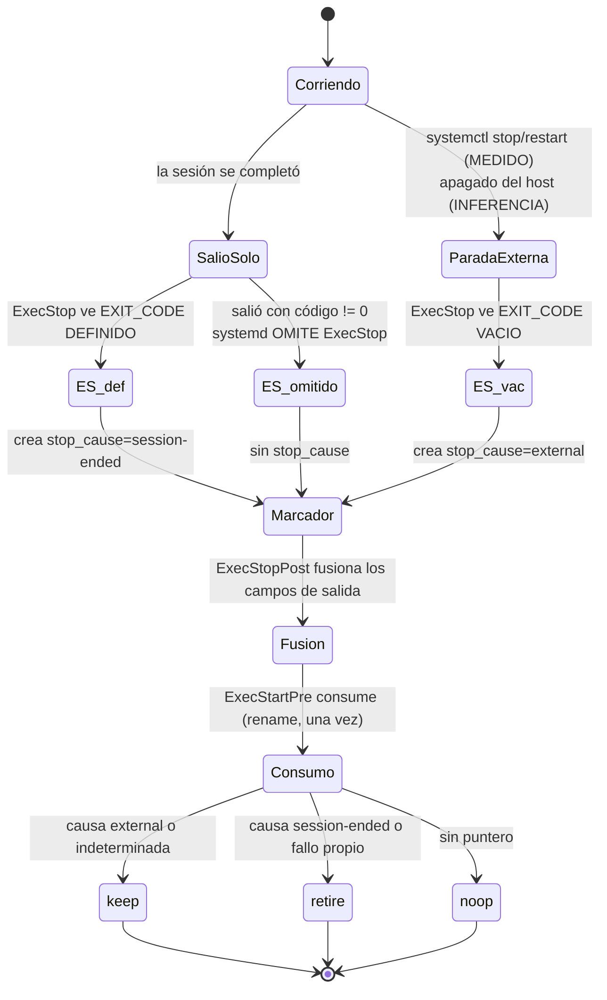

# Data Model: reiniciar el agente deja de romper el enlace del cliente

**Feature**: 024-fix-session-restart-retire
**Fase**: 1 (diseño)

Convención de este documento: cada afirmación sobre el código lleva `archivo:línea`
y fue leída, y cada afirmación sobre systemd está marcada **MEDIDO** (está en la
tabla de [research.md](./research.md) R2) o **INFERENCIA** (se deriva de lo medido
pero no se observó). Nada más se afirma.

---

## Decisión estructural: un solo marcador

El borrador inicial de este documento usaba **dos** ficheros —una constancia escrita
por `ExecStop` y el marcador de `ExecStopPost`— y la pasada de verificación lo tumbó
con razón: obligaba a `ExecStopPost` a leer la constancia sin consumirla, creaba
pares huérfanos que había que clasificar, y contradecía lo que
[plan.md](./plan.md) ya había declarado PASS en el Principio IV.

**El diseño es un único marcador, con dos escritores y un solo consumidor.**

| Quién | Cuándo | Qué hace con el marcador |
|---|---|---|
| hook de `ExecStop` | en toda parada donde systemd lo ejecuta | lo **crea** con el campo de causa |
| hook de `ExecStopPost` | siempre | le **fusiona** los campos de salida |
| hook de `ExecStartPre` | al arrancar | lo **consume** (una vez, por `rename`) y decide |

La fusión de `ExecStopPost` reescribe un fichero que ese mismo par de hooks posee:
es una operación del **lado escritor**. La prohibición que importa —y que
[spec.md](./spec.md) fija en su Edge Case de arranques competidores— es sobre la
**ruta de decisión**, que sigue leyendo exactamente una vez y consumiendo.
Esa distinción es load-bearing: sin ella, cualquier reescritura parecería violar el
consumo único, y con ella el invariante real queda enunciado con precisión.

Nota de atribución: esta regla **no** es FR-006. FR-006 prohíbe sondear, muestrear
o inferir periódicamente la vitalidad de una sesión — otra cosa. La regla del
consumo único viene del Edge Case de arranques competidores y del comportamiento
que 022 ya implementó en `session_exit_marker_consume`
(`scripts/lib/session_pointer.sh:179`).

---

## Entidad 1 · Puntero de sesión

**Qué representa**: el enlace entre el agente y una conversación del cliente. Que
exista o no al arrancar decide si el operador conserva su conversación.

**Dónde vive**: bajo `<workspace>/.state/.claude/projects/<slug>/`, resuelto por
`session_pointer_path` (`scripts/lib/session_pointer.sh:49`).

**Entrada NO CONFIABLE**: lo escribe un proceso externo (Claude Code) con un
esquema que no controlamos. `session_pointer.sh:20` lo dice explícitamente: nada
en esa lib puede ejecutar su contenido. **No conocemos su esquema interno y este
diseño no depende de él** — solo de que el fichero exista o no.

Por eso `session_pointer.sh:14` es la frase que resume el problema: *"The
discriminator the pointer lacks is \*why\* the previous process stopped"*. No es que
al puntero le falte un campo concreto; es que la razón de la parada **no está en el
puntero en absoluto**, y hay que traerla de afuera.

**Estados y transición**:

| Estado | Significado |
|---|---|
| `present` | hay puntero; hay algo que conservar o retirar |
| `absent` | no hay puntero; no hay nada que decidir |
| `unknown` | no se pudo resolver la ruta |

`unknown` lo produce `session_pointer_path` con rc≠0, y **tiene varias causas
distintas**, no una: `CLAUDE_CONFIG_DIR` vacío o que no sea directorio (`:55-56`),
que el listado de `projects` falle (`:63`), y que haya más de un candidato (`:89`).
Todas desembocan en la misma decisión (`noop` + aviso), pero un test escrito solo
contra "más de un candidato" dejaría las otras entradas sin cubrir.

La única transición que este diseño provoca es **retirar**: `session_pointer_retire`
(`:98`) **renombra**, nunca borra (FR-005). El hermano renombrado es la evidencia
forense de que la decisión se tomó.

---

## Entidad 2 · Marcador de salida

**Qué representa**: cómo terminó el proceso anterior. Es el único puente entre el
apagado y el arranque siguiente.

**Ruta**: `session_exit_marker_path` (`scripts/lib/session_pointer.sh:112`).

**Campos actuales** (`session_exit_marker_write`, `:129-147`, escritos con `printf`
y no con `jq` porque `jq` puede faltar en el host del agente):

| Campo | Origen | ¿Lo lee alguien hoy? |
|---|---|---|
| `schema` | constante `1` | no |
| `service_result` | `$SERVICE_RESULT` | **no** |
| `exit_code` | `$EXIT_CODE` | sí — es el `marker` de `session_decide` |
| `exit_status` | `$EXIT_STATUS` | **no** |
| `ts` | `date -u` | no |

Dos de los tres valores de systemd se guardan y **ninguna decisión los mira**
(verificado por `grep`: `service_result` solo aparece en la escritura `:137` y en
aserciones de test). El dato ya estaba ahí.

**Campo nuevo**: `stop_cause`, escrito por el hook de `ExecStop`. Valores
`external` o `session-ended`. Su **ausencia** es un valor con significado propio
(ver Entidad 3).

**Validación**: `_session_marker_has_field` (`:157`) exige que la clave esté
presente y completa, para que un fichero truncado lea como "no se puede
determinar" y nunca como un valor vacío pero válido. El campo nuevo necesita la
misma guarda; hoy ambos helpers (`:150`, `:157`) solo saben leer `exit_code`.

**Consumo único**: `session_exit_marker_consume` (`:179`) hace `rename` y devuelve
el contenido. Dos arranques compitiendo: solo uno gana el `rename`; el perdedor ve
"sin marcador" y cae en la rama de incertidumbre. Ese mecanismo **no cambia**.

---

## Entidad 3 · Causa de parada

**Qué representa**: la clasificación que 022 necesitaba y no tenía.

**De dónde sale — la señal MEDIDA**: systemd puebla `$EXIT_CODE`/`$EXIT_STATUS`
recién cuando el proceso principal ya murió. Por lo tanto, **dentro de `ExecStop`**:

- `$EXIT_CODE` **definido** ⇒ el proceso ya había salido por su cuenta ⇒
  `session-ended`. **MEDIDO** (caso A, 3/3 repeticiones; y con `Restart=always`,
  3/3).
- `$EXIT_CODE` **vacío** ⇒ systemd está iniciando la parada y el proceso sigue
  vivo ⇒ `external`. **MEDIDO** (casos B `systemctl stop`, C `systemctl restart`,
  E ignora-TERM; 3/3 cada uno, y con `Restart=always`, 3/3).

**Lo que NO se midió**: el **apagado del host**. Ningún caso de la sonda lo cubre.
Que caiga en `external` es **INFERENCIA** —un apagado es una parada iniciada por
systemd, así que por la señal medida debería dar `EXIT_CODE` vacío— y así queda
rotulado acá y en [research.md](./research.md) R5. No se convierte en medición por
repetirlo.

**Borde medido**: si el proceso sale solo con código **distinto de 0**, systemd
**omite `ExecStop` por completo** (caso D, código 3). Entonces no hay `stop_cause`
y el marcador llega solo con los campos de `ExecStopPost`. Ojo con generalizar: el
caso E también termina en fallo (`timeout`/`killed`/`KILL`) y ahí `ExecStop` **sí**
corrió. La omisión es específica de *salir solo con código de fallo*, no de
"cualquier fallo".

---

## Entidad 4 · Decisión

Valores: `keep`, `retire`, `noop`. La produce `session_decide`
(`scripts/lib/session_pointer.sh:212-224`), hoy sobre `exit_code` y en adelante
sobre la causa.

### Tabla de decisión

| # | `stop_cause` | Resto del marcador | Causa | Decisión | Respaldo |
| --- | --- | --- | --- | --- | --- |
| 1 | `external` | cualquiera | parada externa | **keep** | MEDIDO (B, C, E) |
| 2 | `session-ended` | cualquiera | la sesión terminó | **retire** | MEDIDO (A) |
| 3 | ausente | `service_result=exit-code` | la sesión terminó en fallo | **retire** | MEDIDO (D) |
| 4 | ausente | ausente, ilegible o truncado | indeterminada | **keep** | **POLÍTICA**, no medición |
| 5 | cualquiera | cualquiera, pero puntero `absent`/`unknown` | nada que decidir | **noop** | comportamiento actual (`:214-217`) |

**La fila 4 no se deriva de ninguna observación.** Es FR-004: una elección
conservadora. Se rotula como política a propósito, porque etiquetarla de "medida"
inflaría el respaldo empírico de la única celda que solo tiene respaldo normativo.

El criterio: conservar de más le cuesta al operador una conversación muerta que
**ve** y puede resolver reiniciando; retirar de más le cuesta trabajo **sin aviso**.
Es el default contrario al actual, y ese cambio es el corazón de la feature.

La fila 4 también cubre la **compatibilidad hacia atrás**: una unit vieja sin la
directiva `ExecStop` nunca escribe `stop_cause`, así que un agente a medio
actualizar conserva en vez de retirar. Degrada hacia el lado seguro.

La fila 3 es la que usa `service_result`, el campo que ya se persiste y que hasta
hoy nadie leía.

---

## Flujo de los tres hooks

**Invariantes del flujo**:

1. Los tres hooks salen 0 pase lo que pase. Ninguno puede convertir un apagado en
   un fallo de unit (Principio IV). Van montados con el prefijo `-` en la unit.
2. Un solo fichero, un solo consumo. No hay pares que aparear ni huérfanos que
   clasificar — el borrador con dos ficheros los tenía, y por eso se descartó.
3. Si el proceso muere entre `ExecStop` y `ExecStopPost`, el marcador queda con
   causa y sin campos de salida. Cae en la fila 1 o 2 según su causa, que es la
   información que importa.
4. Si `session_exit_marker_write` no puede escribir —tiene un early-return medido
   cuando el directorio no existe o no es escribible (`:133-134`)— el marcador
   queda como lo dejó `ExecStop`, o no existe. Ambos estados están en la tabla.

---

## Qué NO se modela

- El contenido del puntero. Es entrada no confiable de esquema ajeno; solo importa
  si existe.
- La vitalidad de la sesión del lado del relay. Consultarla exigiría un detector,
  prohibido por FR-006 y por el precedente `ebfe35f`.
- Antigüedad del puntero. Acotar la conservación por tiempo sería diseñar sobre el
  caso no medido de R5 (apagado largo) — exactamente el error que originó esta
  feature.
